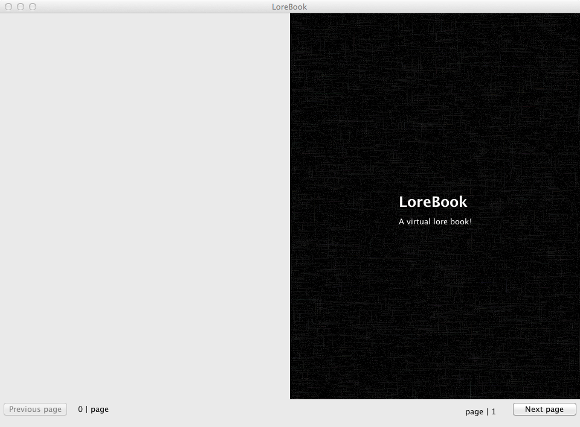

LoreBook
========

LoreBook is a virtual lore book program. It allows you to write pages in markdown and have them appear as a book.

LoreBook is cross-platform and written in Java.

Creating books
--------------

LoreBook currently only has support for one book at a time (there are plans to support more in the future).
Pages are stored in your user directory, in .lorebook/books/book/pages. Write pages in [markdown](http://daringfireball.net/projects/markdown/syntax).
To create a cover for your book, create a "covers" directory within pages. Inside, you may place a "front.md" and "back.md" which will be shown as the front and back cover, respectively.
Covers have a different background and text is centered.
The contents page of the book will be automatically generated.

Sharing books
-------------

Currently, the only way to do this is to share the files within the book directory in .lorebook/books.
